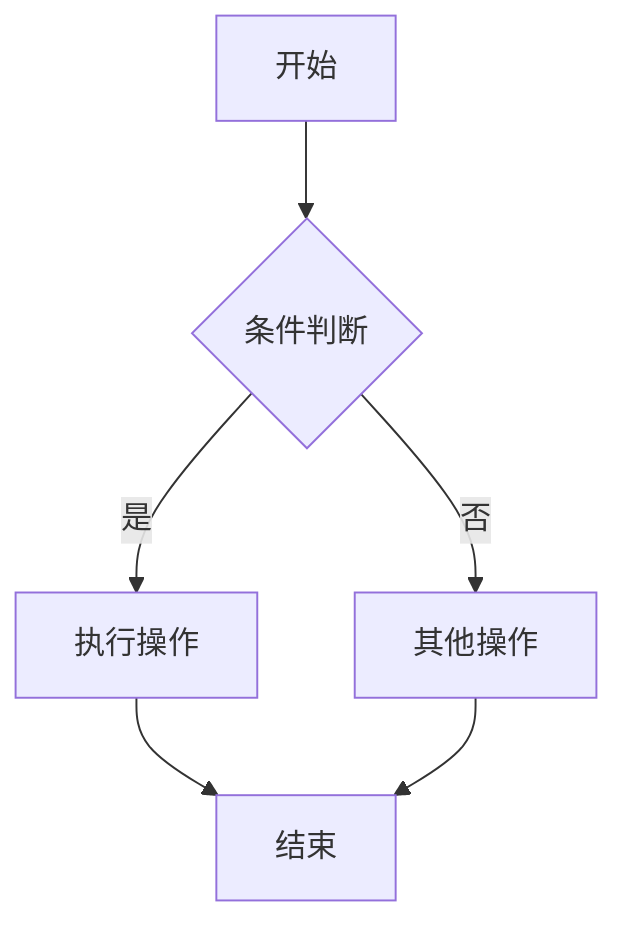
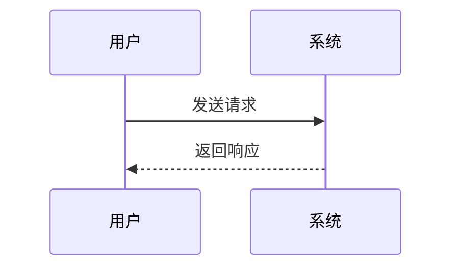
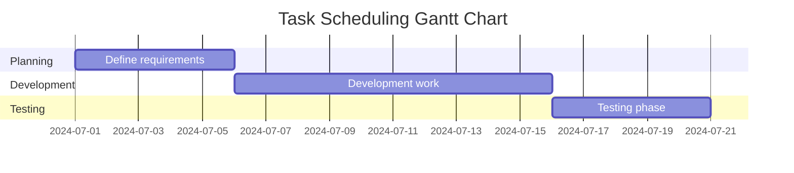

# Mermaid to PNG Converter

一个强大的Python脚本，用于将Mermaid图表代码转换为PNG图像。支持单文件转换、批量转换和直接文本转换。

## 🌟 特性

- ✅ 支持所有Mermaid图表类型（流程图、序列图、甘特图等）
- 📁 批量转换多个文件
- 🎨 自定义配置支持
- 💻 跨平台支持（Windows、macOS、Linux）
- 🚀 简单易用的命令行界面
- 🔧 自动依赖检查

## 📋 系统要求

- Python 3.6+
- Node.js 14+
- npm

## 🚀 快速安装

### 方法1：使用安装脚本（推荐）

```powershell
# 在PowerShell中运行
.\install.ps1
```

### 方法2：手动安装

1. 安装Node.js依赖：
```bash
npm install
```

2. 验证安装：
```bash
python mermaid_to_png.py --check
```

## 📖 使用方法

### Web界面（推荐）

1. **启动Web应用**：
```bash
# 方法1: 使用批处理文件
start_web.bat

# 方法2: 手动启动
pip install -r requirements.txt
python web_app.py
```

2. **打开浏览器访问**：
```
http://localhost:5000
```

3. **Web界面特性**：
- 🎨 美观的现代化界面
- 📝 实时代码编辑器
- 📁 拖拽文件上传
- 🌟 丰富的示例库
- 🎯 一键下载结果
- 📱 响应式设计

### 命令行界面

1. **创建示例文件**：
```bash
python mermaid_to_png.py --sample
```

2. **转换单个文件**：
```bash
python mermaid_to_png.py -f diagram.mmd
python mermaid_to_png.py -f diagram.mmd -o output.png
```

3. **直接转换文本**：
```bash
python mermaid_to_png.py --text "graph TD; A[开始] --> B[结束]"
```

4. **批量转换**：
```bash
python mermaid_to_png.py -d ./diagrams/ -od ./images/
```

### 高级用法

#### 使用自定义配置

创建配置文件 `config.json`：
```json
{
  "theme": "dark",
  "width": 1200,
  "height": 800,
  "backgroundColor": "transparent"
}
```

使用配置：
```bash
python mermaid_to_png.py -f diagram.mmd -c config.json
```

#### 常用Mermaid图表示例

**流程图**：


**序列图**：


**甘特图**：



## 🛠️ 命令行选项

```
用法: python mermaid_to_png.py [选项]

选项:
  -f, --file FILE           输入的Mermaid文件(.mmd)
  -o, --output FILE         输出的PNG文件
  -d, --directory DIR       包含.mmd文件的输入目录
  -od, --output-directory   PNG文件的输出目录
  -t, --text TEXT          Mermaid代码文本
  -c, --config FILE         配置文件(JSON格式)
  --sample                  创建示例Mermaid文件
  --check                   检查依赖项
  -h, --help               显示帮助信息
```

## 📁 项目结构

```
Code2Graph/
├── mermaid_to_png.py      # 主脚本（命令行版本）
├── web_app.py             # Web应用后端
├── templates/             # Web界面模板
│   └── index.html         # 主界面
├── static/                # 静态资源
│   └── style.css          # 自定义样式
├── examples/              # 示例文件夹
│   ├── sample.mmd         # 示例Mermaid文件
│   ├── sequence.mmd       # 序列图示例
│   ├── gantt.mmd          # 甘特图示例
│   └── config.json        # 示例配置文件
├── package.json           # Node.js依赖配置
├── requirements.txt       # Python依赖配置
├── install.ps1           # 安装脚本
├── start_web.bat         # Web应用启动脚本
├── convert.bat           # 命令行快捷脚本
└── README.md             # 说明文档
```

## 🔧 配置选项

支持的配置选项：

```json
{
  "theme": "default|dark|forest|neutral",
  "width": 1200,
  "height": 800,
  "backgroundColor": "white|transparent|#color",
  "configFile": "path/to/mermaid/config.json",
  "scale": 1.0,
  "puppeteerConfigFile": "path/to/puppeteer/config.json"
}
```

## 🐛 故障排除

### 常见问题

1. **"Mermaid CLI not found"错误**：
   - 确保已安装Node.js
   - 运行 `npm install` 安装依赖
   - 检查PATH环境变量

2. **转换失败**：
   - 检查Mermaid语法是否正确
   - 确保输出目录存在且有写权限
   - 尝试使用 `--check` 选项验证安装

3. **中文字符显示问题**：
   - 确保输入文件使用UTF-8编码
   - 在配置中指定合适的字体

### 日志和调试

脚本会显示详细的执行信息：
- ✅ 成功操作
- ❌ 错误信息
- 📊 转换统计

## 🎯 使用场景

- 📚 技术文档生成
- 📋 项目流程图制作
- 🎓 教学材料准备
- 📊 数据流程可视化
- 🔄 CI/CD流程图生成

## 📄 许可证

MIT License - 详见LICENSE文件

## 🤝 贡献

欢迎提交Issues和Pull Requests！

## 📞 支持

如果遇到问题，请：
1. 检查本README的故障排除部分
2. 运行 `python mermaid_to_png.py --check` 检查环境
3. 在GitHub Issues中报告问题

---

**Happy Diagramming! 🎨**
